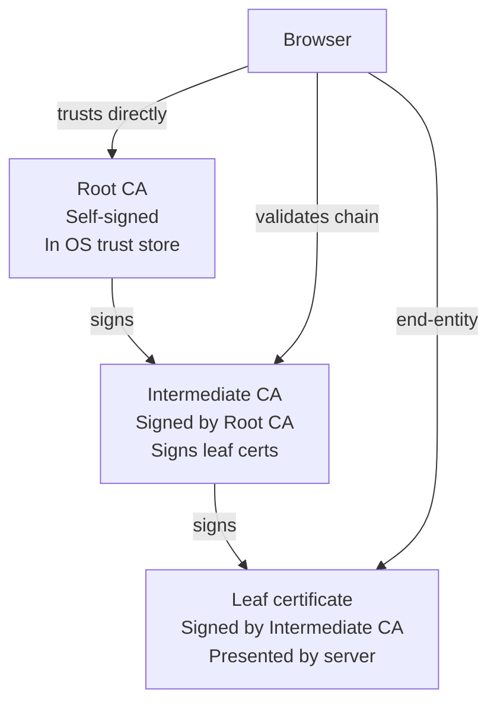

# Certificate Chain

No certificate stands alone. Every TLS certificate traces its trust back through a chain of issuers — intermediate CAs, and ultimately a root CA in the client's trust store. This page explains how the chain works, what each level does, and how certz models it.

## The chain of trust

When a browser connects to an HTTPS server, it receives the server's certificate and needs to decide: is this trustworthy? It cannot have a pre-loaded record of every certificate on the internet. Instead, it checks whether the certificate was signed by a CA that it trusts — or by a CA that is trusted by a CA it trusts, and so on, up to a root.



Each arrow represents a cryptographic signature. The intermediate CA's public key is in a certificate signed by the root. The leaf certificate's public key is in a certificate signed by the intermediate. The browser validates each signature in turn — if the chain is intact and the root is trusted, the leaf certificate is trusted.

## Root CA

A root CA is a self-signed certificate: its issuer and subject are the same entity. The root signs its own certificate. This sounds circular, but the trust does not come from the signature — it comes from the fact that the OS vendor or browser vendor has explicitly added the root certificate to the trust store after vetting the CA.

Root CAs:
- Are self-signed (the Subject and Issuer fields match)
- Are stored in the OS or browser trust store
- Have the `Basic Constraints: CA=true` extension
- In production PKI, **never** directly sign leaf certificates — they sign intermediates instead
- Certz generates self-signed root CAs with `certz create ca --cn "My Root CA"`

For a certz-generated CA, the root is placed in the Windows trust store with `certz trust add` or `--trust` on `create dev`, which makes it authoritative for any certificate it signs.

## Intermediate CA

An intermediate CA sits between the root and the leaf. The root signs the intermediate's certificate; the intermediate signs leaf certificates.

Why use an intermediate at all? The root CA's private key is the most valuable asset in the PKI. Keeping it offline (air-gapped) is standard practice. The intermediate's key can be used operationally to issue certificates, and if it is compromised, only the intermediate needs to be revoked — the root (and its trust relationships) remains intact.

In certz:
- Intermediates are created with `certz create ca` pointing at another CA as the issuer
- The `--path-length` flag controls how many additional CA levels can be beneath this one

## Leaf certificate

A leaf certificate (also called an end-entity certificate) is the certificate presented by the server during a TLS handshake. It is signed by a CA (typically an intermediate), cannot sign other certificates, and has:

- `Basic Constraints: CA=false` (or the extension absent)
- An EKU of Server Authentication (for HTTPS)
- Subject Alternative Names identifying the domains it covers
- A validity period (certz defaults to 90 days for dev certs)

A leaf that tries to sign another certificate will be rejected by any properly implemented TLS stack.

## Path length

The `--path-length` flag on `certz create ca` sets the `pathLenConstraint` value in the Basic Constraints extension. It limits how many additional CA levels can appear below this CA in a chain.

| Value | Meaning |
|-------|---------|
| `-1` (default) | No constraint — unlimited depth below this CA |
| `0` | This CA can only sign leaf certificates, not other CAs |
| `1` | This CA can sign one level of intermediate CAs, which can only sign leaves |
| `N` | Can have N levels of CAs below before reaching leaves |

For a simple two-level PKI (root -> leaf), create the CA with `--path-length 0`:

```
certz create ca --cn "Dev Root CA" --path-length 0
certz create dev --cn api.local --issuer-cert ca.pfx --issuer-password <pass>
```

For a three-level PKI (root -> intermediate -> leaf), the root needs `--path-length 1` or unconstrained:

```
certz create ca --cn "Root CA" --path-length 1 --out root.pfx
certz create ca --cn "Issuing CA" --issuer-cert root.pfx --path-length 0 --out issuing.pfx
certz create dev --cn api.local --issuer-cert issuing.pfx
```

## How certz models chains

**Building a chain:** Use `--issuer-cert` on `create dev` or `create ca` to sign with an existing CA:

```
certz create dev --cn api.local --issuer-cert myca.pfx --issuer-password mypass
```

**Inspecting a chain:** Use `certz inspect --chain` to follow the chain from a leaf up to the root, or `--tree` for a visual hierarchy:

```
certz inspect --file api.local.crt --chain --tree

api.local
  Issued by: Dev Intermediate CA
    Issued by: Dev Root CA (self-signed, trusted)
```

**Validating a chain:** `certz inspect --chain` validates each signature in the chain and reports any gaps, expired intermediates, or untrusted roots.

## Revocation

Revocation is the mechanism for declaring a certificate invalid before it expires — for example, if its private key was compromised.

**CRL (Certificate Revocation List):** A signed list of revoked serial numbers published by the CA at a URL embedded in the certificate (`CRL Distribution Points` extension). Clients download the list periodically and check whether the certificate's serial is on it.

**OCSP (Online Certificate Status Protocol):** A real-time query to the CA's OCSP responder. The client sends the certificate serial and receives a signed `good`, `revoked`, or `unknown` response. OCSP is faster than waiting for a CRL refresh but requires the CA to operate a live responder.

**OCSP Stapling:** The server fetches its own OCSP response and includes it in the TLS handshake, so the browser does not need to contact the CA at connection time. This is the recommended approach for production servers.

`certz inspect --crl` fetches and checks the CRL URL embedded in a certificate:

```
certz inspect --file api.local.crt --crl
CRL status: not revoked (fetched from http://crl.example.com/ca.crl)
```

For certz-generated development certificates, revocation infrastructure is not set up by default — it is not needed for local-only certs.

See [inspect.md](../reference/inspect.md) for the full set of chain and revocation inspection options.

[← Back to concepts](README.md)
