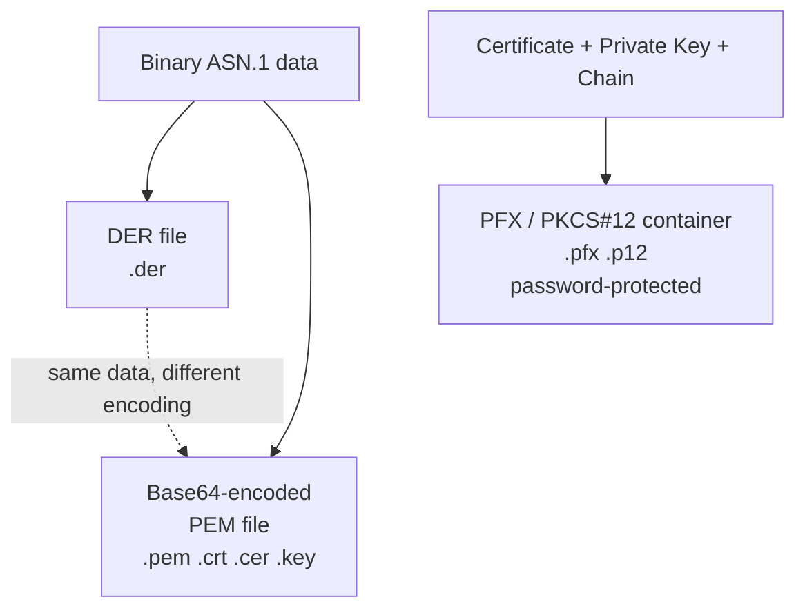

# Certificate Formats

When you work with certificates, you encounter files with extensions like `.pem`, `.crt`, `.cer`, `.key`, `.pfx`, `.p12`, and `.der`. The naming is inconsistent across operating systems and tools, which causes constant confusion. This page explains the three underlying wire formats, what the extensions actually mean, and when to use each one.

## The three wire formats

At the lowest level, every certificate is encoded in one of three ways.

### PEM (Privacy Enhanced Mail)

PEM is a Base64 encoding of the binary certificate data, wrapped in header and footer lines:

```
-----BEGIN CERTIFICATE-----
MIIDazCCAlOgAwIBAgIUY3...
-----END CERTIFICATE-----
```

The header identifies what is inside: `CERTIFICATE`, `PRIVATE KEY`, `RSA PRIVATE KEY`, `CERTIFICATE REQUEST`, and so on. A single PEM file can contain multiple blocks — a certificate chain, for example, is just several certificate blocks concatenated in one file.

PEM originated in email encryption tooling (hence the name), but it became the universal exchange format for certificates on the web. Almost every tool that touches certificates — OpenSSL, nginx, Apache, Let's Encrypt — speaks PEM natively.

### DER (Distinguished Encoding Rules)

DER is the raw binary ASN.1 encoding of the same data that PEM carries in Base64. There are no headers. The file starts with binary bytes and is not human-readable.

DER is the native format for Java KeyStores, some Windows certificate operations, and is commonly used on embedded systems and in mobile apps. It is slightly smaller than PEM because it skips the Base64 overhead.

PEM and DER contain the same information. Converting between them is lossless:

```
certz convert --input cert.pem --format DER --output cert.der
certz convert --input cert.der --format PEM --output cert.pem
```

### PFX / PKCS#12

PFX (also called PKCS#12 or P12) is a binary container format that bundles a certificate, its private key, and optionally the full certificate chain into one password-protected file.

Where PEM and DER can hold a certificate or a key — but not both together — PFX is designed to move a complete identity: everything needed to present a certificate and prove ownership of its private key.

Windows IIS, Azure App Service, and most enterprise systems import certificates as PFX. When you export a certificate from a Windows key store, PFX is the default.



## File extension confusion

Extensions are assigned by convention, not enforced by format. The same file content can appear under different extensions depending on which OS, tool, or team created it.

| Extension | Typical content | Encoding | Notes |
|-----------|-----------------|----------|-------|
| `.pem` | Certificate, key, or chain | Base64 (PEM) | Headers identify what is inside |
| `.crt` | Certificate | PEM or DER | Most Unix/Linux tools use PEM here |
| `.cer` | Certificate | PEM or DER | Windows convention; often DER |
| `.key` | Private key | PEM | Occasionally DER |
| `.pfx` | Cert + key + chain | Binary (PKCS#12) | Password-protected; Windows default |
| `.p12` | Cert + key + chain | Binary (PKCS#12) | macOS and Java convention for PFX |
| `.der` | Certificate | Binary (DER) | Explicit binary extension; no headers |

The practical rule: **the extension tells you nothing guaranteed about the encoding**. A `.crt` file on a Linux server is usually PEM. The same file sent to a Windows developer may be expected as DER. A `.cer` downloaded from a CA website is often DER, but not always.

## How to detect what is in a file

`certz inspect` auto-detects the format before reading:

```
certz inspect --file unknown.crt
```

You can also check manually:

**PEM files** start with a visible ASCII header:
```
-----BEGIN CERTIFICATE-----
```
Open the file in a text editor. If you see that line, it is PEM.

**DER files** start with the byte sequence `30 82` (or sometimes `30 81` or `30 83`). In a hex editor:
```
30 82 03 6B 30 82 02 53 ...
```
In a text editor, a DER file appears as garbled binary characters.

**PFX files** also start with `30 82` but the internal structure includes an encrypted envelope. The reliable check is to try importing it — if a password prompt appears, it is PFX.

`certz inspect` uses the header check for PEM, and for binary files distinguishes DER from PFX by probing the PKCS#12 internal OIDs.

## When to use each format

| Scenario | Format | Reason |
|----------|--------|--------|
| nginx, Apache, HAProxy TLS config | PEM | These servers require separate cert and key files |
| Let's Encrypt / ACME output | PEM | ACME clients always produce PEM |
| Windows IIS, RDS, ADCS | PFX | Windows certificate import expects PFX |
| Azure App Service, AWS ACM import | PFX or PEM | Both supported; PFX for bundled identity |
| Java KeyStore (keytool) | DER or PFX | keytool imports DER; some tools accept PFX |
| macOS Keychain import | PFX (.p12) | Keychain Access uses P12 drag-and-drop |
| API transmission / JSON payload | PEM | Base64 embeds cleanly in JSON strings |
| Embedded / IoT firmware | DER | Smaller, no parsing overhead |
| Code signing certificates | PFX | Signing tools require bundled key |

For a full platform deployment matrix with certz conversion commands for each target, see [convert.md](../reference/convert.md).

[← Back to concepts](README.md)
