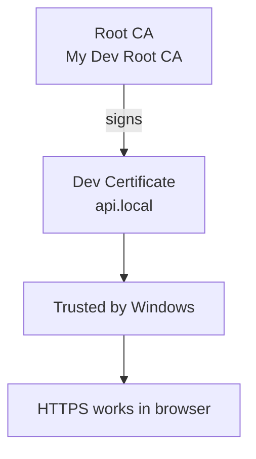

# Quickstart: Local HTTPS in 10 Minutes

This tutorial walks you through creating a complete local PKI -- a Root CA, a signed
development certificate, and making your browser trust it -- all with certz.

**What you will build:**



By the end you will have a trusted `api.local` certificate ready for a local development
server. Every step uses a single certz command.

---

## Prerequisites

- **certz.exe** downloaded and on your PATH (see the README for the download link)
- **Windows** -- trust store operations in this tutorial are Windows-only; `create`,
  `inspect`, `lint`, and `convert` work cross-platform
- A PowerShell or Command Prompt terminal

---

## Step 1 -- Create a Root CA

A Root CA is the anchor of trust. You create it once and sign all your development
certificates with it. See [Certificate Chain](../concepts/certificate-chain.md) for a
full explanation of why a CA is needed.

```bash
certz create ca --name "My Dev Root CA" --days 3650
```

Expected output:

```
Certificate Authority created successfully

  Subject:    CN=My Dev Root CA
  Key:        ECDSA P-256
  Valid:      2025-10-26 to 2035-10-23 (3650 days)
  Thumbprint: A1B2C3D4E5F6...

  Output files:
    PFX:  my-dev-root-ca.pfx
    Pass: Xk9!mP2rLq          <- save this password, you need it in Step 3
```

certz saves the CA as `my-dev-root-ca.pfx` and prints an auto-generated password.
**Copy the password now** -- you will need it in Steps 2 and 3.

> **Tip:** Pass `--password MyPassword` to set a known password instead of using
> the auto-generated one.

---

## Step 2 -- Trust the CA

Add the CA to your Windows trust store so that any certificate it signs is automatically
trusted by Windows and your browser. See
[Windows Trust Store](../concepts/windows-trust-store.md) for details on
`CurrentUser` (your account only) vs `LocalMachine` (all users, requires admin).

```bash
certz trust add my-dev-root-ca.pfx --password Xk9!mP2rLq --store Root
```

Expected output:

```
Certificate added to trust store

  Subject:    CN=My Dev Root CA
  Store:      CurrentUser\Root
  Thumbprint: A1B2C3D4E5F6...
```

> **Alternative -- trust at creation time:** Combine Steps 1 and 2 into one command
> by adding `--trust` to `create ca`. certz creates the CA and immediately adds it to
> the trust store.
>
> ```bash
> certz create ca --name "My Dev Root CA" --days 3650 --trust
> ```

---

## Step 3 -- Create a Signed Dev Certificate

Create a certificate for `api.local` signed by the CA you just created. certz
automatically adds `localhost` and `127.0.0.1` as Subject Alternative Names. The
`--san` flag adds any extra names you need.

See [Subject Alternative Names](../concepts/subject-alternative-names.md) for why
SANs matter for modern browsers.

```bash
certz create dev api.local \
  --issuer-cert my-dev-root-ca.pfx \
  --issuer-password Xk9!mP2rLq \
  --san "*.api.local"
```

Expected output:

```
Development certificate created successfully

  Subject:    CN=api.local
  Issuer:     CN=My Dev Root CA    <- signed by your CA
  Key:        ECDSA P-256
  SANs:       api.local, *.api.local, localhost, 127.0.0.1
  Valid:      2025-10-26 to 2026-01-23 (90 days)
  Thumbprint: B3C4D5E6F7A8...

  Output files:
    PFX:  api-local.pfx
    Pass: mR7!xN3pKz          <- save this password
```

certz saves the certificate as `api-local.pfx`.

> **Auto-added SANs:** certz always adds `localhost` and `127.0.0.1` to dev
> certificates so they work for local server testing without extra flags.

---

## Step 4 -- Inspect the Certificate

Verify the certificate is correct before deploying it.

### Basic inspection

```bash
certz inspect api-local.pfx --password mR7!xN3pKz
```

Key things to check in the output:

- **Issuer** should be `CN=My Dev Root CA` (not self-signed)
- **SANs** should include `api.local`, `*.api.local`, `localhost`, `127.0.0.1`
- **Validity** should be 90 days from today
- **Key** should be `ECDSA P-256`

### Chain tree

Confirm the full chain from end-entity up to the trusted Root CA:

```bash
certz inspect api-local.pfx --password mR7!xN3pKz --tree
```

Expected chain tree:

```
Certificate Chain
=================

Root CA (depth 1)
  Subject:    CN=My Dev Root CA
  Thumbprint: A1B2C3D4E5F6...
  Key:        ECDSA P-256
  Validity:   2025-10-26 to 2035-10-23
  Self-signed: Yes

End-entity (depth 0)
  Subject:    CN=api.local
  Issuer:     CN=My Dev Root CA
  Thumbprint: B3C4D5E6F7A8...
  Key:        ECDSA P-256
  SANs:       api.local, *.api.local, localhost, 127.0.0.1
  Validity:   2025-10-26 to 2026-01-23
```

Both levels present = the chain is complete and trusted.

---

## Step 5 -- Lint the Certificate

Run the lint check to verify the certificate meets modern browser requirements:

```bash
certz lint api-local.pfx --password mR7!xN3pKz
```

Expected output for a freshly created dev certificate:

```
Lint Results: api-local.pfx

  Policy:  dev
  Subject: CN=api.local
  Result:  PASSED (0 errors, 0 warnings)
```

A CA-signed cert with SANs, ECDSA P-256 key, and 90-day validity passes all dev-policy
checks. See [certz lint](../reference/lint.md) for the full rule reference.

---

## Step 6 -- Convert for Deployment (Optional)

The PFX format works directly for IIS and Windows services. For other servers, convert
first:

```bash
# nginx or Apache (PEM format)
certz convert api-local.pfx --to pem --password mR7!xN3pKz

# Produces:
#   api-local.crt   (certificate)
#   api-local.key   (private key)
```

**nginx configuration snippet:**

```nginx
server {
    listen 443 ssl;
    server_name api.local;
    ssl_certificate     /path/to/api-local.crt;
    ssl_certificate_key /path/to/api-local.key;
}
```

**IIS:** Import `api-local.pfx` directly via the IIS Manager certificate store -- no
conversion needed.

See [certz convert](../reference/convert.md) for the full platform matrix (Apache,
Tomcat, Java, Kubernetes, Azure App Service, and more).

---

## Cleanup -- Remove the CA When Done

When you no longer need the local PKI, remove the CA from the trust store to keep
your trust store clean. Leaving dev CAs permanently trusted is poor hygiene -- a
leaked private key could be used to issue fraudulent certificates.

```bash
certz trust remove --subject "CN=My Dev Root CA" --force
```

Expected output:

```
Removed 1 certificate(s) from CurrentUser\Root
  CN=My Dev Root CA  (A1B2C3D4E5F6...)
```

After removal, any certificates signed by this CA will no longer be trusted.

---

## What to Read Next

| Topic | Link |
|-------|------|
| Full create options (ephemeral mode, pipe mode, RSA keys) | [certz create](../reference/create.md) |
| Set up expiry monitoring and CI/CD alerts | [certz monitor](../reference/monitor.md) |
| Renew a certificate without re-entering parameters | [certz renew](../reference/renew.md) |
| Understand PEM, DER, PFX and when to use each | [Certificate Formats](../concepts/certificate-formats.md) |
| How the Windows trust store works | [Windows Trust Store](../concepts/windows-trust-store.md) |
| Interactive wizard mode | [Wizard Guide](wizard.md) |
