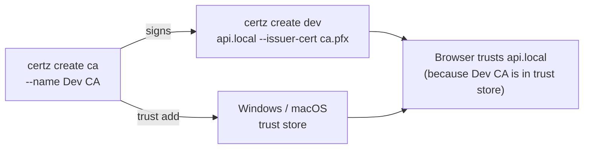
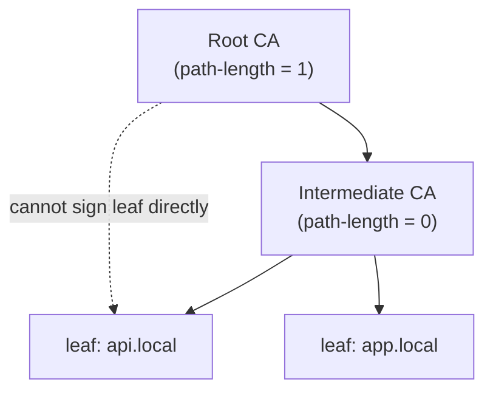

# certz create -- Reference

Create X.509 certificates for local development or as a Certificate Authority.

**See also:**
[RSA vs ECDSA](../concepts/rsa-vs-ecdsa.md) |
[Subject Alternative Names](../concepts/subject-alternative-names.md) |
[Certificate Lifecycle](../concepts/certificate-lifecycle.md) |
[Certificate Chain](../concepts/certificate-chain.md) |
[Windows Trust Store](../concepts/windows-trust-store.md)

---

## Overview

`certz create` has two subcommands:

| Subcommand | Purpose |
|------------|---------|
| `create dev` | Leaf certificate for a hostname. TLS server auth, 90-day default. |
| `create ca` | Certificate Authority. Signs other certs, 10-year default. |

Typical flow: create a CA once, then sign any number of dev certificates with it:



---

## Development Certificates (`create dev`)

### Quick Examples

| Goal | Command |
|------|---------|
| Basic localhost cert | `certz create dev localhost` |
| Auto-trust after creation | `certz create dev api.local --trust` |
| 30-day validity | `certz create dev app.local --days 30` |
| Extra SANs | `certz create dev app.local --san "*.app.local" --san "192.168.1.10"` |
| Signed by your CA | `certz create dev api.local --issuer-cert ca.pfx --issuer-password pass` |
| RSA key | `certz create dev app.local --key-type RSA --key-size 4096` |
| Custom output filenames | `certz create dev app.local --file server.pfx --cert server.cer --key server.key` |
| Ephemeral (no files) | `certz create dev app.local --ephemeral` |
| Pipe to stdout | `certz create dev app.local --pipe` |

### Defaults

When you run `certz create dev app.local` without extra flags:

| Property | Value |
|----------|-------|
| Key type | ECDSA P-256 |
| Validity | 90 days |
| SANs | CN (`app.local`), `localhost`, `127.0.0.1` (auto-added) |
| EKU | Server Authentication |
| Output | `app.local.pfx`, `app.local.cer`, `app.local.key` |
| Password | Auto-generated, printed to console |

### Full Options

| Option | Default | Description |
|--------|---------|-------------|
| `<domain>` | (required) | Common Name and primary SAN. |
| `--san <name>` | (none) | Additional Subject Alternative Names. Repeatable. certz auto-detects IP vs DNS. See [SANs](../concepts/subject-alternative-names.md). |
| `--eku <value>` | `serverAuth` | Extended Key Usage. Repeatable. Values: `serverAuth`, `clientAuth`, `codeSigning`, `emailProtection`. See [EKU](../concepts/enhanced-key-usage.md). |
| `--days <n>` | `90` | Validity in days. Maximum 398 (CA/B Forum limit for leaf certs). |
| `--key-type` | `ECDSA-P256` | Key algorithm: `ECDSA-P256`, `ECDSA-P384`, `ECDSA-P521`, `RSA`. See [RSA vs ECDSA](../concepts/rsa-vs-ecdsa.md). |
| `--key-size` | `3072` | RSA key size in bits: `2048`, `3072`, `4096`. Only applies when `--key-type RSA`. |
| `--hash-algorithm, --hash` | `auto` | Hash algorithm for signing: `sha256`, `sha384`, `sha512`, or `auto`. `auto` selects based on key type -- see [Hash Algorithm Auto-Selection](#hash-algorithm-auto-selection) below. |
| `--issuer-cert` | (none) | Sign with this CA file (PFX or PEM+key). Without this, cert is self-signed. |
| `--issuer-key` | (none) | CA private key file. Required when `--issuer-cert` is a PEM file without an embedded key. |
| `--issuer-password` | (none) | Password for a PFX `--issuer-cert`. |
| `--trust` | `false` | Install to the trust store immediately after creation. |
| `--trust-location` | `CurrentUser` | Trust store scope: `CurrentUser` or `LocalMachine`. `LocalMachine` requires admin. See [Windows Trust Store](../concepts/windows-trust-store.md). |
| `--file` | `<domain>.pfx` | Output PFX filename. |
| `--cert` | `<domain>.cer` | Output certificate filename. |
| `--key` | `<domain>.key` | Output private key filename. |
| `--password` | (auto-generated) | PFX password. Printed to console when auto-generated. |
| `--password-file` | (none) | Write the generated password to this file instead of the console. |
| `--ephemeral, -e` | `false` | Generate in memory only. No files written. See [Ephemeral Mode](#ephemeral-mode) below. |
| `--pipe` | `false` | Stream certificate to stdout. No files written. See [Pipe Mode](#pipe-mode) below. |
| `--pipe-format` | `pem` | Output format for `--pipe`: `pem`, `pfx`, `cert`, `key`. |
| `--pipe-password` | (auto-generated) | Password for `--pipe --pipe-format pfx`. Written to stderr. |
| `--dry-run, --dr` | `false` | Preview what would be created (subject, SANs, key type, validity, output file) without creating anything. Exit 0 on valid options, 1 on invalid. |
| `--guided` | `false` | Launch the interactive wizard. After creation, prints the equivalent direct CLI command so you can reproduce the result without re-running the wizard. |
| `--format` | `text` | Output display format: `text` or `json`. |
| `--verbose` | `false` | Emit diagnostic lines to stderr: key gen, file writes, trust store access, full exception details. |

### Ephemeral Mode

`--ephemeral` generates the certificate entirely in memory. Nothing is written to disk.

```bash
# View cert details without saving any files
certz create dev app.local --ephemeral

# Machine-readable output for CI checks
certz create dev app.local --ephemeral --format json

# Inspect a specific key type before committing
certz create dev app.local --ephemeral --key-type RSA --key-size 4096
```

Use cases:
- CI/CD: verify certz settings are correct without leaving files to clean up
- Security-sensitive environments where private keys must never touch disk
- Demonstrations and training

Restrictions -- `--ephemeral` cannot be combined with:
- `--file`, `--cert`, `--key` (file output)
- `--trust` (cannot install an in-memory certificate)
- `--password-file` (no file to protect)
- `--pipe` (mutually exclusive; pick one)

### Pipe Mode

`--pipe` streams certificate content to stdout, making it composable with other tools.
No files are written to disk.

```bash
# Default: PEM cert + key to stdout
certz create dev app.local --pipe

# Create Kubernetes TLS secret without intermediate files
certz create dev app.local --pipe | kubectl create secret tls app-tls --cert=/dev/stdin --key=/dev/stdin

# Certificate only
certz create dev app.local --pipe --pipe-format cert

# Private key only
certz create dev app.local --pipe --pipe-format key

# Base64-encoded PFX, explicit password
certz create dev app.local --pipe --pipe-format pfx --pipe-password "MySecret"

# Base64-encoded PFX, auto-generated password written to stderr
certz create dev app.local --pipe --pipe-format pfx 2>password.txt > cert.b64
```

Pipe formats:

| `--pipe-format` | Output written to stdout |
|-----------------|--------------------------|
| `pem` (default) | PEM certificate followed by PEM private key |
| `cert` | PEM certificate only |
| `key` | PEM private key only |
| `pfx` | Base64-encoded PKCS#12. Password printed to stderr (or via `--pipe-password`). |

Restrictions -- `--pipe` cannot be combined with:
- `--file`, `--cert`, `--key` (file output)
- `--trust` (cannot install a piped certificate)
- `--password-file`
- `--ephemeral` (mutually exclusive; pick one)

### JSON Output Schema

```bash
certz create dev app.local --format json
```

Example output:

```json
{
  "subject": "CN=app.local",
  "thumbprint": "A1B2C3D4E5F6...",
  "notBefore": "2026-02-21T00:00:00Z",
  "notAfter": "2026-05-22T00:00:00Z",
  "keyType": "ECDSA-P256",
  "sans": ["app.local", "localhost", "127.0.0.1"],
  "outputFiles": ["app.local.pfx", "app.local.cer", "app.local.key"],
  "password": "Xk9!mP2rLq",
  "passwordWasGenerated": true,
  "wasTrusted": false,
  "isCA": false,
  "pathLength": -1,
  "isEphemeral": false,
  "wasPiped": false
}
```

| Field | Type | Description |
|-------|------|-------------|
| `subject` | string | Full subject DN (`CN=...`) |
| `thumbprint` | string | SHA-1 thumbprint (hex, no colons) |
| `notBefore` | ISO 8601 | Validity start (UTC) |
| `notAfter` | ISO 8601 | Validity end (UTC) |
| `keyType` | string | `ECDSA-P256`, `ECDSA-P384`, `ECDSA-P521`, or `RSA` |
| `sans` | string[] | All Subject Alternative Names on the certificate |
| `outputFiles` | string[] | Files written (empty when ephemeral or piped) |
| `password` | string or null | PFX password (only present when auto-generated) |
| `passwordWasGenerated` | bool | `true` when certz chose the password |
| `wasTrusted` | bool | `true` when `--trust` was used and succeeded |
| `isCA` | bool | `false` for dev certs |
| `pathLength` | int | `-1` for leaf certs |
| `isEphemeral` | bool | `true` when `--ephemeral` was used |
| `wasPiped` | bool | `true` when `--pipe` was used |

### Hash Algorithm Auto-Selection

When `--hash-algorithm auto` (the default) is used, certz selects the signing hash based on
key type and size to match the security level of the key:

| Key type | Key size / curve | Hash selected |
|----------|-----------------|---------------|
| ECDSA | P-256 | SHA-256 |
| ECDSA | P-384 | SHA-384 |
| ECDSA | P-521 | SHA-512 |
| RSA | 2048 | SHA-256 |
| RSA | 3072 | SHA-384 |
| RSA | 4096+ | SHA-512 |

Use an explicit value only when a compliance requirement mandates a specific algorithm:

```bash
# Force SHA-384 regardless of key type
certz create dev app.local --hash sha384

# Force SHA-512 for a FIPS-140 environment
certz create ca --name "Internal CA" --key-type RSA --key-size 4096 --hash sha512
```

---

### Troubleshooting

| Problem | Likely cause | Fix |
|---------|--------------|-----|
| Auto-generated password missing from output | `--pipe` sends the cert to stdout; the password goes to stderr | Capture stderr: `certz ... --pipe 2>pass.txt` |
| "File already exists" error | Previous run left an output file with the same name | Delete the file or use `--file` to specify a different name |
| Browser still shows untrusted after `--trust` | `CurrentUser` store is not used by all browsers | Try `--trust-location LocalMachine` (requires admin). See [Windows Trust Store](../concepts/windows-trust-store.md). |
| IP SAN not accepted by browser | IP address formatted as DNS SAN | Use `--san "192.168.1.1"` -- certz auto-detects IP vs DNS type |
| "Validity exceeds 398 days" | `--days` set over the CA/B Forum limit | Use 398 or fewer. For long-lived certs, use a CA and sign leaf certs. |

---

## CA Certificates (`create ca`)

### Quick Examples

| Goal | Command |
|------|---------|
| Basic dev CA | `certz create ca --name "Dev CA"` |
| Trust it immediately | `certz create ca --name "Dev CA" --trust` |
| 10-year validity | `certz create ca --name "My CA" --days 3650` |
| Restrict to signing leaf certs only | `certz create ca --name "Issuing CA" --path-length 0` |
| With CRL and OCSP URLs | `certz create ca --name "My CA" --crl-url http://crl.example.com/ca.crl --ocsp-url http://ocsp.example.com` |

### Path Length

`--path-length` controls how many intermediate CA layers are allowed beneath this CA.



| `--path-length` | Meaning |
|-----------------|---------|
| `-1` (default) | Unlimited: can sign any depth of intermediates |
| `0` | Can only sign leaf certificates (cannot sign other CAs) |
| `1` | Can sign one level of intermediate CAs, which then sign leaf certs |

For a simple local dev setup, `-1` (unlimited) is fine. Use `0` when creating an issuing CA under a root CA to prevent the issuing CA from being used to create further sub-CAs.

### Full Options

| Option | Default | Description |
|--------|---------|-------------|
| `--name` | (required) | Common Name for the CA. Becomes the certificate subject. |
| `--days <n>` | `3650` | Validity in days (~10 years). CA certs are not subject to the 398-day leaf limit. |
| `--path-length <n>` | `-1` | Chain depth limit. See above. |
| `--key-type` | `ECDSA-P256` | Key algorithm: `ECDSA-P256`, `ECDSA-P384`, `ECDSA-P521`, `RSA`. |
| `--key-size` | `3072` | RSA key size. Only applies when `--key-type RSA`. |
| `--hash-algorithm, --hash` | `auto` | Hash algorithm for signing: `sha256`, `sha384`, `sha512`, or `auto`. See [Hash Algorithm Auto-Selection](#hash-algorithm-auto-selection) below. |
| `--crl-url` | (none) | CRL Distribution Point URL embedded in the certificate. |
| `--ocsp-url` | (none) | OCSP responder URL embedded in the Authority Information Access extension. |
| `--trust` | `false` | Install to trust store after creation. |
| `--trust-location` | `CurrentUser` | `CurrentUser` or `LocalMachine`. See [Windows Trust Store](../concepts/windows-trust-store.md). |
| `--file` | `<name>.pfx` | Output PFX filename. |
| `--cert` | `<name>.cer` | Output certificate filename. |
| `--key` | `<name>.key` | Output private key filename. |
| `--password` | (auto-generated) | PFX password. |
| `--password-file` | (none) | Write the generated password to this file. |
| `--ephemeral, -e` | `false` | Generate in memory only. |
| `--pipe` | `false` | Stream to stdout. |
| `--pipe-format` | `pem` | `pem`, `pfx`, `cert`, `key`. |
| `--pipe-password` | (auto-generated) | Password for `--pipe --pipe-format pfx`. Written to stderr. |
| `--dry-run, --dr` | `false` | Preview what would be created (subject, key type, validity, output file) without creating anything. Exit 0 on valid options, 1 on invalid. |
| `--guided` | `false` | Launch the interactive wizard. After creation, prints the equivalent direct CLI command so you can reproduce the result without re-running the wizard. |
| `--format` | `text` | `text` or `json`. |
| `--verbose` | `false` | Emit diagnostic lines to stderr: key gen, file writes, trust store access, full exception details. |

### JSON Output Schema

```bash
certz create ca --name "Dev CA" --format json
```

Example output:

```json
{
  "subject": "CN=Dev CA",
  "thumbprint": "B3C4D5E6F7A8...",
  "notBefore": "2026-02-21T00:00:00Z",
  "notAfter": "2036-02-21T00:00:00Z",
  "keyType": "ECDSA-P256",
  "sans": [],
  "outputFiles": ["Dev CA.pfx", "Dev CA.cer", "Dev CA.key"],
  "password": "Lp3!qN8wXz",
  "passwordWasGenerated": true,
  "wasTrusted": false,
  "isCA": true,
  "pathLength": -1,
  "isEphemeral": false,
  "wasPiped": false
}
```

The schema is identical to `create dev`. Key differences for CA output:

| Field | CA value |
|-------|----------|
| `isCA` | `true` |
| `sans` | Empty array (CAs do not require SANs) |
| `pathLength` | The value passed to `--path-length` (default `-1`) |

### Troubleshooting

| Problem | Likely cause | Fix |
|---------|--------------|-----|
| Certs signed by this CA not trusted by browser | CA is not in the system trust store | Run `certz trust add <ca.pfx>` or recreate with `--trust` |
| "Path length exceeded" error when signing | CA has `--path-length 0` and you tried to sign an intermediate | Use `--path-length -1` or sign leaf certs directly from this CA |
| `--trust` prompts for elevation | `LocalMachine` store requires admin privileges | Run as admin, or use `CurrentUser` and share the CA cert manually |
